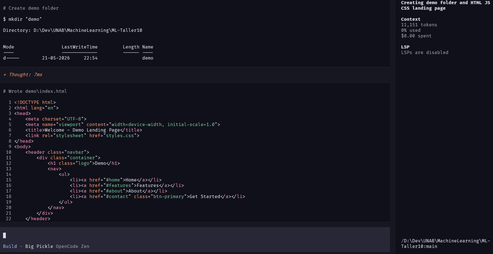

# Documento Técnico — ML-Taller10

## Descripción del Sistema

Este proyecto implementa un flujo automatizado que combina un agente Product Manager (PM) basado en LLM con un asistente de codificación (OpenCode/Ollama) para generar código page a partir de historias de usuario escritas en lenguaje natural.

**Componentes principales:**

- **PM Agent** (`pm-agent/`): Script Python que lee historias de usuario desde `stories.txt`, las envía a un modelo LLM local (Ollama + llama3.1) y produce epics con tareas técnicas en formato JSON.
- **OpenCode + Ollama** (`opencode.json`): Configuración de un asistente de código IA que consume un modelo local (`qwen3.5-4b`) vía Ollama en `http://127.0.0.1:1234/v1`.
- **Demo** (`demo/`): Landing page funcional (HTML/CSS/JS) que implementa los requerimientos generados por el agente PM.

El objetivo es demostrar un pipeline donde una necesidad expresada en lenguaje natural se traduce automáticamente a requerimientos estructurados y luego a código funcional.

---

## Arquitectura General

```
┌─────────────────────────────────────────────────────────┐
│                    stories.txt                          │
│  "As a user, I want to see a landing page..."           │
└──────────────────────┬──────────────────────────────────┘
                       │
                       ▼
┌─────────────────────────────────────────────────────────┐
│               pm-agent/main.py                          │
│                                                         │
│  1. Lee stories.txt                                     │
│  2. Construye prompt estructurado                       │
│  3. Envía a Ollama (modelo: llama3.1)                   │
│  4. Parsea respuesta JSON con Pydantic                  │
│  5. Guarda epics/*.json                                 │
└──────────────────────┬──────────────────────────────────┘
                       │
                       ▼
┌─────────────────────────────────────────────────────────┐
│         epics/Landing_Page_Development.json             │
│  { "epic": "Landing Page Development",                  │
│    "tasks": [                                           │
│      { "title": "Task Title...", "priority": "High" },  │
│      { "title": "Task Title...", "priority": "Medium" } │
│    ]                                                    │
│  }                                                      │
└──────────────────────┬──────────────────────────────────┘
                       │
                       ▼
┌─────────────────────────────────────────────────────────┐
│              demo/ (Implementación)                     │
│                                                         │
│  - index.html   (estructura HTML semántica)             │
│  - styles.css   (diseño responsive con gradientes)      │
│  - script.js    (scroll suave, animaciones, menú móvil) │
└─────────────────────────────────────────────────────────┘
```

**Tecnologías clave:**

| Componente | Tecnología | Propósito |
|---|---|---|
| PM Agent | Python 3.12 + Ollama + Pydantic | Generar requerimientos desde LLM |
| Modelo PM | llama3.1 (local) | Procesamiento de lenguaje natural |
| Coding Agent | OpenCode + Ollama (qwen3.5-4b) | Asistencia en generación de código |
| Frontend | HTML5 / CSS3 / JavaScript vanilla | Landing page demo |

**Flujo de datos:**

1. El usuario escribe una historia de usuario en `stories.txt`.
2. `main.py` envía la historia a Ollama con un prompt que instruye al modelo a actuar como PM senior.
3. Ollama responde con un JSON estructurado que contiene epics y tareas con prioridades.
4. El script valida el JSON contra esquemas Pydantic y persiste cada epic como archivo individual en `epics/`.
5. Los archivos JSON sirven como entrada para que OpenCode (guiado por humanos o autónomo) implemente la solución.

---

## Resultados Obtenidos




1. **Generación automática de requerimientos:** El agente PM procesó exitosamente la historia de usuario y produjo un epic (`Landing Page Development`) con dos tareas priorizadas:
   - *Design and Develop Landing Page Layout* — Prioridad: **Alta**
   - *Implement Get Started and Learn More Buttons* — Prioridad: **Media**

2. **Landing page funcional:** La demo implementa completamente los criterios de aceptación definidos en `stories.txt`:
   - Encabezado limpio con título y descripción corta
   - Botones "Get Started" y "Explore More" (equivalente a "Learn More")
   - Secciones adicionales (Features, About) con animaciones y diseño responsive
   - Navegación fluida con sombra dinámica en navbar
   - Menú adaptable para dispositivos táctiles

3. **Integración local completa:** Todo el pipeline corre sin dependencias externas de red — Ollama opera en localhost, garantizando privacidad de datos y funcionamiento offline.

4. **Pipeline reproducible:** El proceso completo desde historia de usuario → requerimientos → código demo está documentado y es ejecutable con los comandos provistos.

---

## Limitaciones Observadas


1. **Dependencia de modelos locales:** La calidad del output depende directamente del modelo LLM local. `llama3.1` puede producir resultados inconsistentes con prompts más complejos o historias ambiguas. Modelos más pequeños (`qwen3.5-4b`) pueden degradar aún más la calidad.

2. **Acoplamiento manual demo-agent:** Actualmente no existe un enlace automatizado entre los JSON generados y la implementación en `demo/`. La traducción de requerimientos a código requiere intervención humana o el uso manual de OpenCode como asistente.

3. **Sin tests automatizados:** No hay tests unitarios ni de integración para el agente PM, lo que dificulta la detección de regresiones al modificar prompts o modelos.

4. **Manejo de errores básico:** Si el LLM devuelve JSON mal formado, el script imprime el error y el contenido crudo, pero no reintenta ni implementa estrategias de reparación (ej. resubir con corrección o fallback a parsing parcial).

